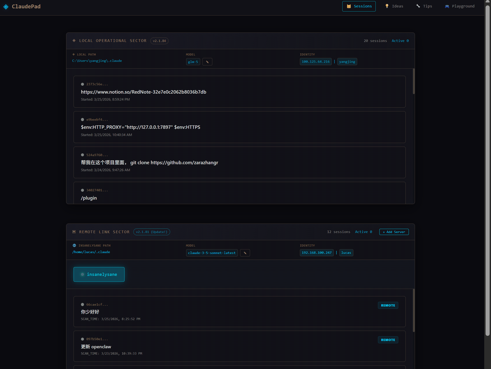

# Changelog

All notable changes to this project will be documented in this file.

## [0.3.26] - 2026-03-26

### Added
- **Symmetric Sector Layout**: Redesigned the main dashboard into a vertical single-column stack with symmetric "Local Operational Sector" and "Remote Link Sector".
- **Environment-Aware Config Editing**: Added support for editing configurations (Model, API URL, API Key) for both local and specific remote servers directly from the dashboard.
- **Sector-Level Versioning**: Integrated version badges into each sector header for independent version tracking and environment-specific updates.
- **Sheikah-Themed Scrollbars**: Implemented custom narrow scrollbars with cyan glow effects for session lists.
- **Guided Empty State**: Added a tech-aesthetic placeholder for the Remote sector when no servers are configured to guide new users.
- **Dynamic Terminal Identity**: Improved display of host and user information in config bars with environment-aware labeling.

### Changed
- **Config Decentralization**: Removed the global top config bar and embedded localized config info within each sector.
- **UI Performance**: Implemented client-side configuration caching to improve responsiveness of edit modals.
- **Refined Animations**: Enhanced the Sheikah Slate theme with better scanline effects and staggered entrance animations for session cards.
- **Rendering Logic**: Simplified remote session rendering by removing redundant nested panel structures.

### Fixed
- Alignment issues in config bars by enforcing CSS Grid (3-column) distribution.
- Bug where remote configuration couldn't be edited or wasn't correctly identified.
- Version check logic to support multiple badge instances across different environments.

### Assets

## [0.3.08.2] - 2026-03-25
### Added
- Redesigned Agent Playground with software development team theme.
- Link (PM) coordinates with Revali (Scout/Analyst), Mipha (Frontend), Urbosa (Backend), and Daruk (QA).
- Added Westworld-style character wandering and dialogue system.
- Hyrule landscape elements (mountains, hills, trees) to the Canvas map.

## [0.3.08] - 2026-03-24
### Added
- Agent Playground with Zelda-themed activity monitoring.
- Features Link as Commander with four Champions as sub-agents.
- Real-time status tracking and activity logs.

## [0.3.0] - 2026-03-20
### Changed
- Major backend refactoring with modular architecture.
- Split monolithic server into routes, services, and websocket handlers.
- Added TypeScript types and SSH key auth support.

## [0.2.31] - 2026-03-18
### Added
- Multi-level caching (memory + file cache) for session loading.
- Pagination support.
### Changed
- Optimized session loading performance.
- Enhanced terminal UI for better session information display.
### Fixed
- Token counting and improved error handling.

## [0.2.30] - 2026-03-17
### Added
- CC Tips page for browsing Claude Code tips.
- Features random tip display, full-text search, and copy to clipboard.

## [0.2.29] - 2026-03-16
### Changed
- Updated navigation bar with unified style for all links.

## [0.2.28] - 2026-03-15
### Added
- CC Ideas page for capturing and managing inspiration.
- Session monitoring with real-time status, token count, and duration.

## [0.2.27] - 2026-03-14
### Changed
- Updated theme to Sheikah Slate.
- Loads session information directly from `~/.claude/` directory.

## [0.2.26] - 2026-03-13
### Added
- Implemented basic features with a unified color scheme.
