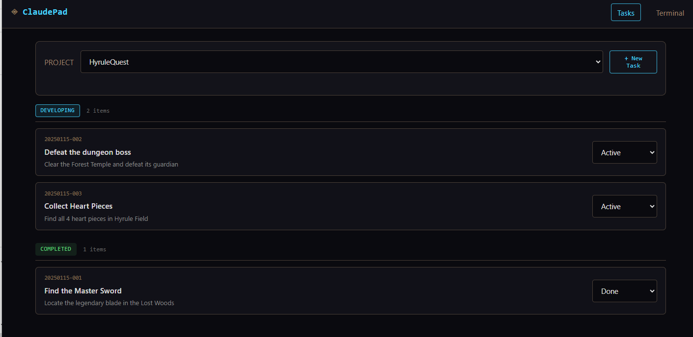

# ClaudePad

Web-based task manager for Claude Code with a Sheikah Slate aesthetic.


*Task board with Sheikah Slate theme - bronze/cyan interface*

## Features

- **Zero dependencies** - Pure Node.js, no runtime packages
- **Sheikah Slate UI** - Ancient-tech aesthetic with bronze/cyan theme
- **Kanban board** - Vertical task columns (pending/active/review/done)
- **Built-in terminal** - Browser-based bash via Server-Sent Events
- **JSON storage** - Simple file-based data, no database needed
- **Mobile-first** - Works on phones, tablets, desktop

## Quick Start

```bash
# Start server
node server.js

# Or dev mode with hot reload
npm install  # only devDependencies
npm run dev
```

Open http://localhost:8080

## Tech Stack

| Layer | Technology |
|-------|------------|
| Backend | TypeScript + native Node.js HTTP |
| Frontend | Alpine.js + vanilla CSS |
| Terminal | xterm.js + SSE |
| Storage | JSON files |

## API Endpoints

```
GET  /api/projects              # List projects
POST /api/projects              # Create project
GET  /api/:project/tasks        # List tasks
POST /api/:project/tasks        # Create task
POST /api/:project/tasks/:id/status  # Update status
GET  /terminal/stream           # Terminal SSE stream
POST /terminal/input            # Send input to terminal
```

## Project Structure

```
├── server.ts          # TypeScript source
├── server.js          # Compiled output
├── static/
│   ├── css/sheikah.css    # Sheikah Slate theme
│   └── js/lib/xterm.*     # Terminal libs
├── templates/
│   ├── index.html      # Task board
│   └── terminal.html   # Terminal page
└── data/               # JSON storage (gitignored)
```

## Design Philosophy

**Sheikah Slate aesthetic**: Ancient Hyrule technology meets modern interface.
- Deep blue-black backgrounds (`#0a0a0f`)
- Bronze/copper accents (`#8B7355`)
- Cyan energy glows (`#00d4ff`)
- Clean monospace typography

## License

MIT
